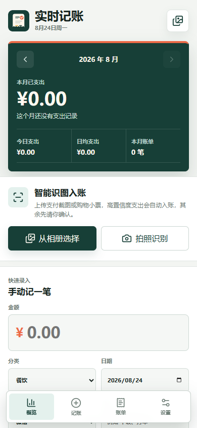
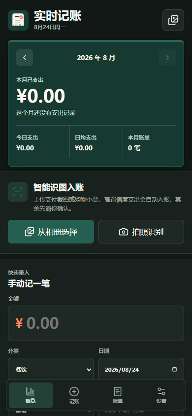

# 实时记账

手机优先的个人支出记账应用。支持手动记账、微信/支付宝/银行卡消费截图 OCR 自动入账、月度分类统计，并可打包成 Android APK。

## 界面预览

<p align="center">
  
  
</p>

深绿色月度概览集中展示当月支出、日均支出和账单数量；底部快捷导航可快速切换概览、记账、账单与设置。

## 功能

- 手动记账：金额、分类、日期、备注、支付方式。
- 智能识图：Android 使用离线 PP-OCRv6 tiny，Web/PWA 使用 Tesseract.js；Android 通过原生 URI 读取图片，避免大图 base64 过桥。
- 保真取图：正方向且尺寸合理的截图原样交给识别引擎，不重编码；只有需要按 EXIF 摆正或超出像素预算的照片才解码一次，上报尺寸始终与实际识别的像素一致。
- 坐标化解析：结合文字框位置、识别置信度和“实付/合计”等语义锚点提取金额。
- 安全入账：高置信度支出自动记录；金额冲突、收入、退款和低置信度结果先进入人工确认。
- 账单列表：一次识别多笔支出，过滤收入和退款后支持勾选批量入账。
- 历史查看：支持月份切换、关键词/分类筛选，并按 30 笔分页加载。
- 预算与分类：支持月预算、超支提示和自定义分类。
- 安全删除：误删记录可在 5 秒内撤销。
- 本地保存：数据保存在浏览器或 Android WebView 的 `localStorage`；Android 每 5 次变更及应用进入后台时还会写一份私有 JSON 快照。
- 原子快照：快照先写临时文件再改名，并保留上一份；即使写入过程中进程被系统杀掉也不会留下截断的备份。
- 可靠备份：Android 将 JSON 写入 `Documents/实时记账/` 后打开系统分享面板；Web 下载后提示用户确认文件。
- 统计看板：今日支出、所选月份支出、日均、预算进度和分类占比。
- 离线 OCR：APK 只内置 PP-OCRv6 ONNX 模型，首次识别无需下载；浏览器版按需加载 Tesseract，空闲 60 秒自动释放。
- 明确降级策略：Android 为控制包体不内置 Tesseract；PP-OCRv6 初始化或识别失败时会直接提示错误，不会静默切换引擎。
- 深色模式：跟随系统明暗主题。
- PWA 支持：网页端可添加到手机主屏幕。

## 技术栈

- React 19
- TypeScript
- Vite
- Tesseract.js
- PaddleOCR PP-OCRv6 tiny
- ONNX Runtime Android
- OpenCV Android
- Capacitor Android
- vite-plugin-pwa
- oxlint

## 目录结构

```text
.
├── android/              # Capacitor Android 工程
│   └── ppocr-sdk/        # 固定版本的 PaddleOCR Android SDK 与离线模型
├── public/               # 静态资源和离线 OCR 资源
│   └── tesseract/
├── scripts/              # 打包与 OCR 调试脚本
├── src/                  # React 应用源码
├── capacitor.config.ts
├── environment.yml       # Conda 环境
├── package.json
└── vite.config.ts
```

## 环境准备

推荐使用 Conda：

```powershell
conda env create -f environment.yml
conda activate spend-app
npm install
```

也可以不用激活环境，直接通过 `conda run` 执行命令：

```powershell
conda run -n spend-app npm install
```

## 本地开发

```powershell
conda run -n spend-app npm run dev
```

如果需要手机在同一局域网访问：

```powershell
conda run -n spend-app npm run dev -- --host 0.0.0.0
```

## 构建网页版本

```powershell
conda run -n spend-app npm run lint
conda run -n spend-app npm test
conda run -n spend-app npm run build
```

构建结果输出到 `dist/`。

## 构建 Android APK

1. 安装 Android SDK。
2. 设置环境变量 `ANDROID_HOME` 或 `ANDROID_SDK_ROOT` 指向 Android SDK 目录。
3. 确保当前环境能使用 JDK 21。
4. 目标设备为 Android 8.0（API 26）或更高版本。

同步 Android 工程并构建 debug APK：

```powershell
conda run -n spend-app npm run android:sync
conda run -n spend-app npm run android:debug
conda run -n spend-app npm run android:copy-debug-apk
```

输出文件：

```text
实时记账-debug.apk
android/app/build/outputs/apk/debug/app-debug.apk
```

debug APK 可以直接安装到 Android 手机。安装时如果系统提示未知来源应用，需要允许当前文件管理器或浏览器安装应用。

Android 构建仅包含 `arm64-v8a` 和 `armeabi-v7a`，不会打入模拟器用的 x86/x86_64 原生库，也不会复制 Web 版 Tesseract 资源。官方 OpenCV 4.12.0 的 64 位原生库支持 Android 16 KB page size；CI 会运行 Android Lint 和 `zipalign -P 16` 防止回归。

### 正式签名与版本

默认开发版本为 `versionCode 2` / `versionName 1.1.0`。CI 或发布机可通过环境变量覆盖：

```powershell
$env:SPEND_APP_VERSION_CODE = '3'
$env:SPEND_APP_VERSION_NAME = '1.2.0'
$env:SPEND_RELEASE_STORE_FILE = 'C:\secure\spend-release.jks'
$env:SPEND_RELEASE_STORE_PASSWORD = '...'
$env:SPEND_RELEASE_KEY_ALIAS = 'spend'
$env:SPEND_RELEASE_KEY_PASSWORD = '...'
cd android
.\gradlew.bat assembleRelease
```

Release 构建已开启 R8 与资源收缩；缺少完整签名变量时会主动失败，避免误发未签名包。密钥和密码不要写入仓库。

## OCR 调试

运行全部回归测试（金额、存储、备份、去重与 OCR 解析）：

```powershell
conda run -n spend-app npm test
```

只运行 OCR 字段解析测试可执行 `npm run test:ocr`。

可以用本地脚本查看截图的文字框、置信度和结构化交易候选：

```powershell
conda run -n spend-app node scripts/probe-ocr.mjs "C:\path\to\screenshot.jpg" chi_sim+eng
```

## 数据说明

- 所有账单数据保存在本机 `localStorage`；Android 的应用私有目录还保留最新和上一份 JSON 快照，并与 WebView 数据一起纳入系统云备份/换机迁移。若启动时发现账单或设置任一部分缺失/损坏，应用会只恢复缺失部分（最新快照读不出时自动回退到上一份）。
- 截图识别的原始文本只保留 200 字摘要用于排查。完整保存会随账单条数线性膨胀，很快就会超出 WebView 约 5–10 MB 的 `localStorage` 配额。
- 当前版本没有账号系统、云同步和服务器。
- 卸载应用、清除应用数据或清理浏览器站点数据会删除本地账单。

## 开源前注意

- 不要提交 `node_modules/`、`dist/`、Android 构建产物、APK、日志文件和本机 Android SDK 路径。
- `android/ppocr-sdk/` 固定到 PaddleOCR 上游提交并内置 PP-OCRv6 tiny 模型；`public/tesseract/` 仅供 Web/PWA 使用，Android 构建会排除它。
- 正式发布到应用商店前，应提供自己的 release 签名、递增版本号并补充隐私政策。

## License

MIT
